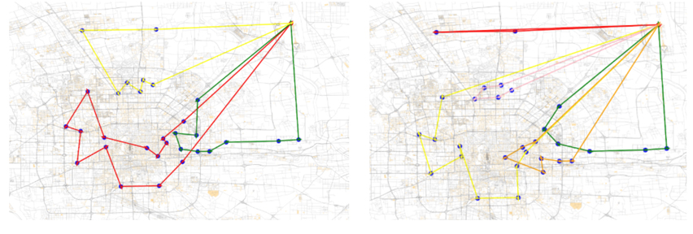
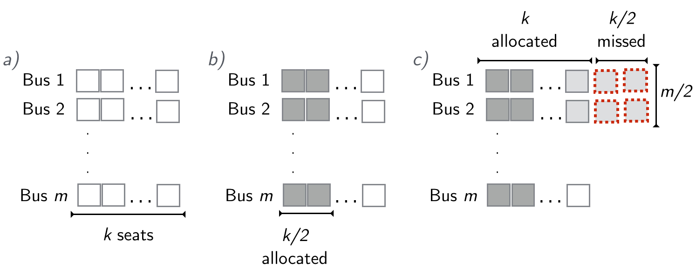

I feel like I put a lot of effort and learnt a lot in the _Algorithms Design and Analysis_ course that Prof. X. Gao teaches at SJTU. Uploading problem set solutions would probably infringe the university's Code of Ethics, however, I'm fairly sure the final projects are meant to be showcased, and hence this is my project. I spent a long time working on it with my partner, and we got one of the best grades in the class. Here it is for posterity.

We were asked to develop algorithms for several problems from the Capacitated Vehicle Routing Problem family. Most of these are NP-Hard problems, however in the project we  propose 5 different approximation algorithms and prove the bounds. A lot of it is original work, so we might develop it some more and publish it in the near future. I'm particularly proud of the proof in the last page.

 

